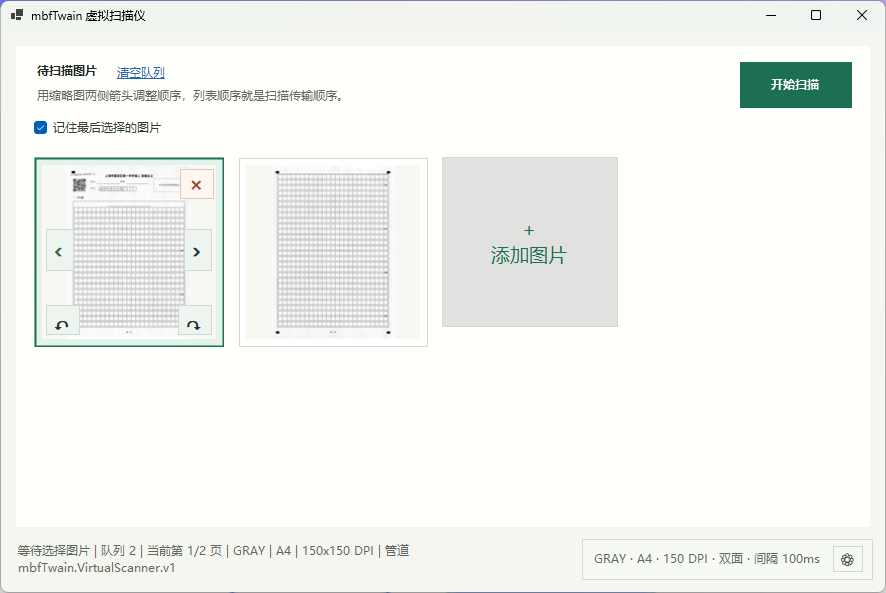
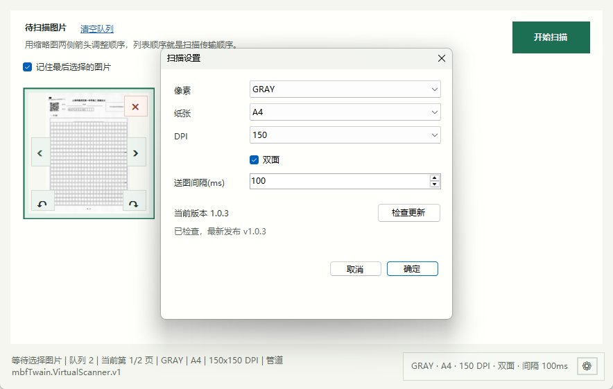
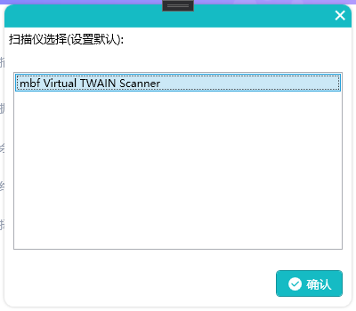

# mbfTwain — 虚拟 TWAIN 扫描仪

[](LICENSE)
[](https://github.com/fengbuming/mbfTWAIN/releases)

[English](README.en.md) | **中文**

`mbfTwain` 是一个分阶段实现的虚拟 TWAIN 2.x 扫描仪。它以原生 C++ TWAIN Data Source 模块为核心，配合 .NET 图像选择 UI，让任何支持 TWAIN 协议的应用程序都能从"虚拟扫描仪"中获取预先准备好的图像——无需真实硬件，即可完成扫描流程的开发、测试与演示。

当前已完成第一阶段至第四阶段 A 的脚手架：原生 DS 模块导出 `DS_Entry`，跟踪 Source Loaded / Opened / Enabled / Transfer Ready 状态，协商核心扫描仪能力，通过命名管道连接 .NET 图像选择 UI，在 TWAIN 主机启用源 UI 时启动新的图像选择会话，并支持原生 DIB 图像传输与缓冲内存传输。

## 功能特性

- **完整 TWAIN 2.x 生命周期**：实现 `DS_Entry` 入口，覆盖 Source Loaded → Opened → Enabled → Transfer Ready 全状态机
- **双架构支持**：同时提供 Win32 与 x64 构建，适配 32 位 / 64 位 TWAIN 主机应用
- **原生 DIB 与内存传输**：支持 `DAT_IMAGENATIVEXFER`（原生 DIB）与 `DAT_IMAGEMEMXFER`（缓冲内存）两种图像传输模式
- **可视化图像选择 UI**：.NET WPF 界面支持添加、删除、重排图像，队列顺序即扫描传输顺序
- **可配置扫描参数**：像素格式（GRAY / RGB / BW）、纸张尺寸（A4 / Letter 等）、DPI、双面扫描、送纸间隔均可调
- **Named Pipe IPC**：DS 与 UI 进程通过命名管道通信，支持 UI 延迟就绪（delayed-ready）回调路径
- **自动更新检查**：配置 UI 内置 GitHub Release 版本检测，一键下载并以 UAC 提权安装更新

## 界面预览

### 主界面 — 图像队列与扫描控制



主界面展示待扫描图像队列。缩略图两侧的箭头可调整顺序，列表顺序即为扫描传输顺序；点击"添加图片"可加入新图像，"开始扫描"后将按队列顺序向 TWAIN 主机传输图像。底部状态栏实时显示队列长度、当前页码、像素格式、纸张尺寸、DPI 与连接状态。

### 扫描设置 — 参数配置与版本更新



扫描设置对话框支持配置像素格式、纸张尺寸、DPI 分辨率、双面扫描及送纸间隔。对话框同时显示当前版本，并提供"检查更新"按钮，可直接检测 GitHub 上的最新 Release 并下载安装。

### 主机端选择 — TWAIN 源列表



在任意支持 TWAIN 协议的主机应用程序中，`mbf Virtual TWAIN Scanner` 会出现在可用扫描仪列表中。选择并确认后，主机应用即可通过标准 TWAIN 流程与虚拟扫描仪交互。

## 项目结构

```text
external/twain/2.4/twain.h              官方 TWAIN 2.4 公共头文件
src/VirtualTwainDS/                     原生 C++ TWAIN Data Source 模块
src/VirtualScannerConfig/               .NET 图像选择与配置 UI
docs/twain-discovery.md                 TWAIN 应用发现 DS 的机制说明
docs/phase-1-architecture.zh-CN.md      第一阶段架构设计笔记（中文）
docs/phase-2-capabilities.zh-CN.md      第二阶段能力协商行为
docs/ipc-protocol.zh-CN.md              第三阶段命名管道 IPC 协议
docs/phase-4a-native-transfer.zh-CN.md  第四阶段 A：原生 DIB 传输行为
tools/SmokeDsEntry/                      DS_Entry 最小加载冒烟测试
tools/SmokeIpcClient/                    C++ IPC 客户端冒烟测试
tools/FakeScannerPipeServer/             用于传输测试的确定性管道服务器
```

## 构建

在 Visual Studio Developer PowerShell 中执行：

```powershell
msbuild .\src\VirtualTwainDS\VirtualTwainDS.vcxproj /p:Configuration=Release /p:Platform=Win32
msbuild .\src\VirtualTwainDS\VirtualTwainDS.vcxproj /p:Configuration=Release /p:Platform=x64
```

32 位 TWAIN 应用使用 Win32 构建，64 位应用使用 x64 构建。TWAIN 源由 Data Source Manager 在进程内加载，因此位数必须与主机进程匹配。

构建输出使用 `.ds` 扩展名，因为 DSM 发现机制要求 TWAIN Data Source 模块使用该扩展名。

项目默认使用 MSVC `v143` 工具集。如 Visual Studio 安装使用其他工具集，可修改 `src/VirtualTwainDS/VirtualTwainDS.vcxproj` 中的 `PlatformToolset` 值，或通过 `/p:PlatformToolset=<installed-toolset>` 覆盖。

## 冒烟测试

`tools/SmokeDsEntry/SmokeDsEntry.cpp` 动态加载构建好的 DS 模块，并调用生命周期与能力三元组：

```text
DAT_IDENTITY / MSG_GET
DAT_IDENTITY / MSG_OPENDS
DAT_IDENTITY / MSG_CLOSEDS
DAT_STATUS   / MSG_GET
```

`tools/SmokeIpcClient/SmokeIpcClient.cpp` 连接配置 UI 的命名管道服务器，验证 C++ IPC 客户端可读取 UI 状态。

`tools/FakeScannerPipeServer` 可在测试传输路径时代替 UI：

```powershell
dotnet build .\tools\FakeScannerPipeServer\FakeScannerPipeServer.csproj -c Release
dotnet .\tools\FakeScannerPipeServer\bin\Release\net10.0\mbfTwain.FakeScannerPipeServer.dll --image .\build\test-assets\page1.bmp --connections 3 --revision 42
```

在伪服务器监听后，设置 `MBF_SMOKE_EXPECT_XFERREADY=1` 并对构建好的 `.ds` 运行 `SmokeDsEntry.exe`。同时设置 `MBF_SMOKE_USE_MEMORY=1` 可测试 `DAT_IMAGEMEMXFER` 而非 `DAT_IMAGENATIVEXFER`。

要测试 UI 风格的延迟就绪路径，以 `--scan 0 --scan-after-begin-delay-ms 200 --connections 40` 启动伪服务器，并设置 `MBF_SMOKE_EXPECT_ENABLE_CALLBACK=1`。这将断言 DS 在首次显式 `DAT_EVENT` 轮询之前触发 `DAT_NULL/MSG_XFERREADY`。

## 运行时 UI

当 TWAIN 主机以 `ShowUI=TRUE` 调用 `DAT_USERINTERFACE / MSG_ENABLEDS` 时，DS 会请求 UI 进程开始新的扫描会话。如果 UI 尚未运行，DS 会尝试从以下位置启动 `mbfTwain.VirtualScannerConfig.exe`：

```text
MBF_TWAIN_UI_EXE
mbfVirtualTwainDS.ds 所在目录
src\VirtualScannerConfig\bin\Release\net10.0-windows
```

UI 会清空上一次的图像列表，显示自身，等待图像选择，然后在用户点击"开始扫描"后发送这些图像。一旦向 TWAIN 主机的图像传输开始，DS 会要求 UI 隐藏但不清除会话状态。最后一次传输确认后，UI 清空列表并保持隐藏，直到下一次扫描。如果主机将 `CAP_XFERCOUNT` 设为正值，DS 在当前会话中仅传输该数量的图像，并丢弃额外选中的图像。

对于已安装的 TWAIN 源，将 `.ds` 文件和 `mbfTwain.VirtualScannerConfig.*` 运行时文件复制到同一 TWAIN 源目录，或设置 `MBF_TWAIN_UI_EXE` 指向 `mbfTwain.VirtualScannerConfig.exe` 的完整路径。

## 发布打包

使用本地 Inno Setup 6 构建并打包发布安装程序：

```powershell
.\tools\Build-Release.ps1 -Version 1.1.0 -InnoSetupPath "D:\Program Files (x86)\Inno Setup 6"
```

该脚本以仅构建模式复用 `Install-LocalTwain.ps1`，暂存 Win32 与 x64 TWAIN 源构建，运行冒烟测试（除非传入 `-SkipSmoke`），然后生成：

```text
build\release\mbfTwain-Setup-v<version>.exe
build\release\mbfTwain-Setup-v<version>.exe.sha256
```

打包后将提交的构建发布到 GitHub Releases：

```powershell
.\tools\Publish-GitHubRelease.ps1 -Version 1.1.0
```

安装程序将 DS 和 UI 运行时文件复制到 `C:\Windows\twain_32` 和 `C:\Windows\twain_64`，并设置机器环境变量 `MBF_TWAIN_FORCE_UI=1`。

## 更新检查

配置 UI 会先访问 `https://api.github.com/repos/fengbuming/mbfTWAIN/releases/latest` 检测最新 GitHub Release；官方 API 不可达时自动回退到 `gh-proxy.com` 镜像。设置对话框中的"检查更新"按钮会下载匹配 `*Setup*.exe` 的发布安装程序资产到用户临时更新目录，然后以 UAC 提权启动安装。安装包下载同样支持官方直链优先、`ghproxy.net` 与 `gh-proxy.com` 镜像兜底，并在安装前校验 GitHub 返回的 SHA-256 digest。

如果 GitHub 仓库为私有，请在启动 UI 前设置 `MBF_TWAIN_GITHUB_TOKEN` 为可读取仓库 Release 的令牌。公开 Release 无需令牌。

## 许可证

`mbfTwain` 是源代码可见的非商业使用软件，基于 [PolyForm Noncommercial License 1.0.0](LICENSE) 发布。商业使用需事先获得版权所有者的书面许可。详见 [COMMERCIAL-LICENSE.md](COMMERCIAL-LICENSE.md) 和 [NOTICE](NOTICE)。

## 致谢

- 感谢 [TWAIN Working Group](https://twain.org/) 提供开放的 TWAIN 协议规范与参考实现。
- 感谢 [shu26.cfd](https://shu26.cfd) 对开源项目的支持与赞助。
